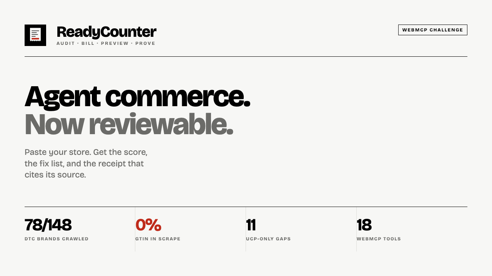
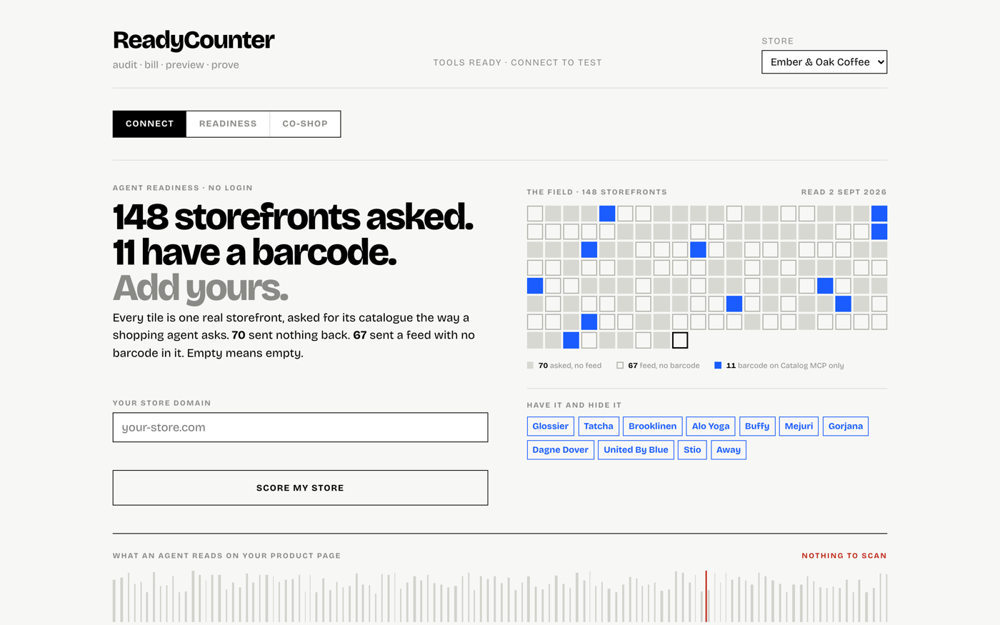
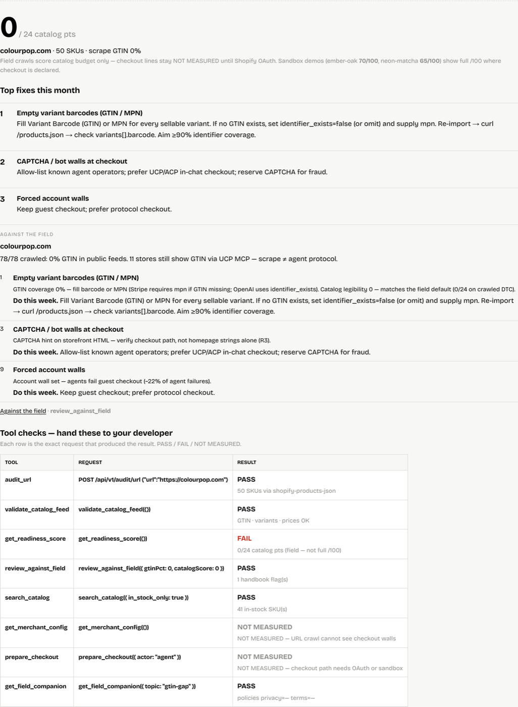
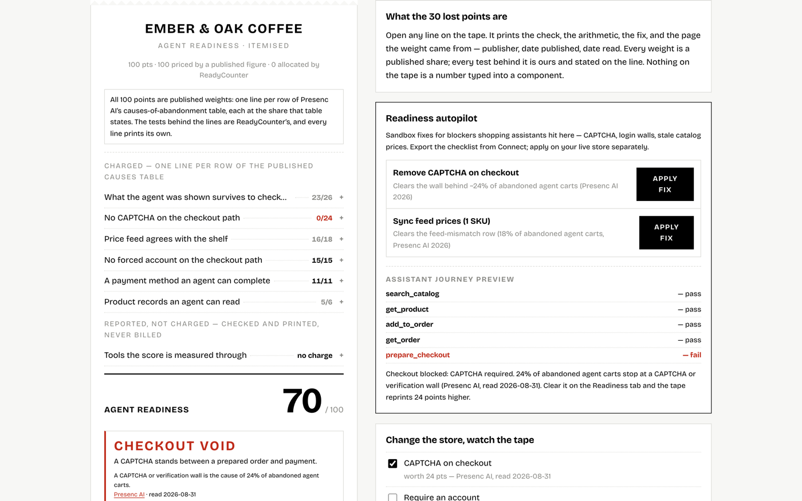
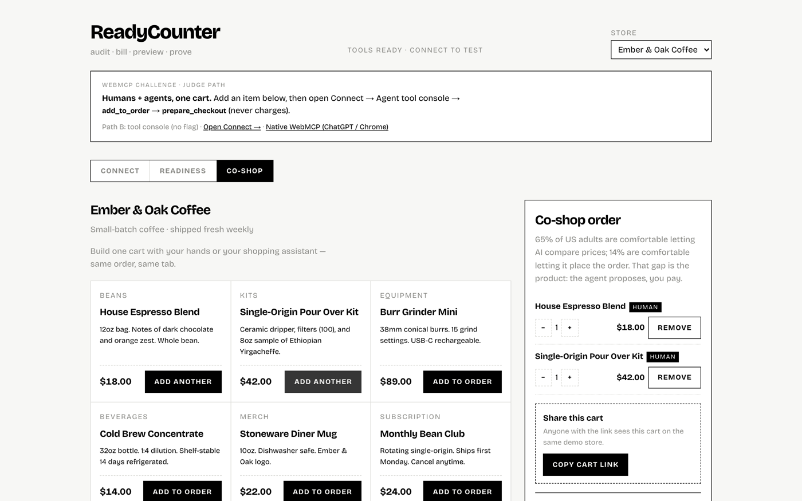
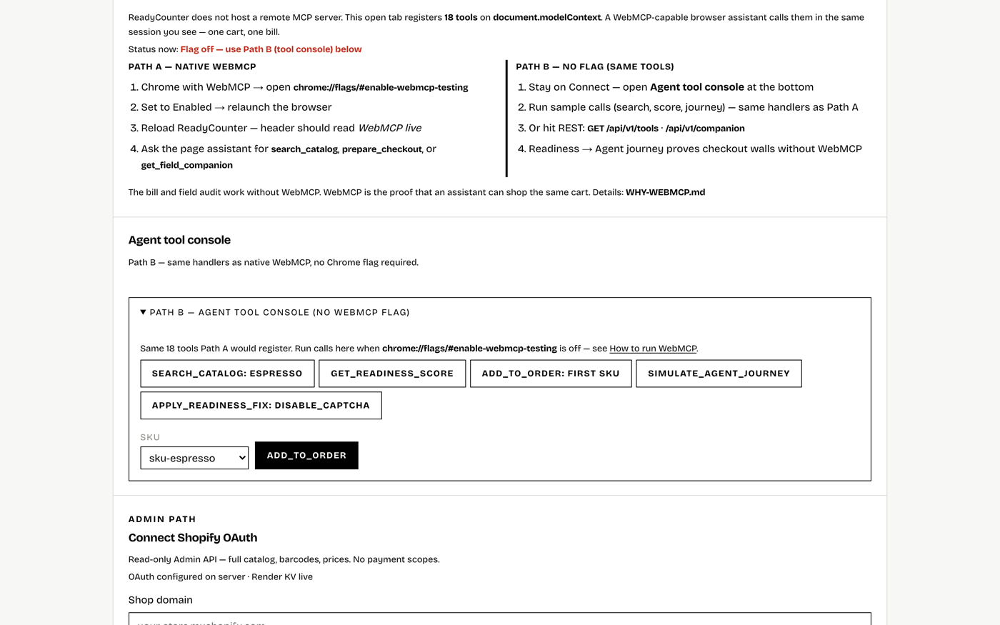

# ReadyCounter

**Agent commerce. Now reviewable.**

Score your storefront the way a shopping agent reads it — then shop it alongside
the agent, in one cart, through 18 browser-native WebMCP tools.

**[readycounter.vercel.app](https://readycounter.vercel.app)** · no signup, no
install, no key · **[60-second judge path](https://readycounter.vercel.app/?judge=1)**
· **[TESTING.md](TESTING.md)**

Built for the [WebMCP Challenge](https://webmcp.devpost.com/). MIT licensed.

---

## The finding

We asked **148 real DTC storefronts** for their catalogue the way an agent asks.

| | |
|---|---|
| **70** | sent nothing back at all |
| **67** | sent a feed with **no barcode in it** |
| **0%** | average GTIN coverage across every store that answered |
| **11** | publish barcodes to Shopify's Catalog MCP **and hide them on their own storefront** |

Those eleven are Glossier, Tatcha, Brooklinen, Alo Yoga, Buffy, Mejuri, Gorjana,
Dagne Dover, United By Blue, Stio and Away. The protocol has the data. The
scrape — which is what a shopper's agent reads — does not.

Re-run our exact query:

```bash
curl -s https://readycounter.vercel.app/api/v1/rankings \
  | jq '{succeeded,shopCount,avgGtinPct,ucp}'
# {"succeeded":78,"shopCount":148,"avgGtinPct":0,
#  "ucp":{"available":81,"withGtin":13,"gtinWhereCrawlZero":11}}
```

---

## The front door

Every tile is one real storefront. Empty means empty — the emptiness is the
measurement, not a placeholder.



## What an agent reads on your product page

A bar is inked only where a product exposes a GTIN. At 0% the code is grey and
unscannable.


## Paste a domain, get a receipt

A live audit of `colourpop.com` — 50 SKUs, 0% scrape GTIN, scored 0 out of 24
catalogue points, with a fix list that names its source on every line.



## The bill

Every point is one row of a published abandonment table, at the share that table
states, with the publisher and the date we read it printed on the line.



## Human and agent, one cart

A person's click and an agent's `add_to_order` land on the same order, tagged
`HUMAN` or `AGENT`. `prepare_checkout` validates the total and **never charges a
card** — the agent proposes, the person pays.



## A real model shops the store

The page hands a language model these 18 tools and one instruction. It picks the
calls; the browser runs them through `document.modelContext`. Nothing is
scripted — and it gets stopped by the same CAPTCHA a real customer's agent hits:

```
→ search_catalog({})                     8 products
→ get_product({"id":"sku-espresso"})     detail
→ get_product({"id":"sku-cold-brew"})    compares
→ add_to_order({"id":"sku-espresso"})    {"ok":true,"lineId":"line-…"}
→ prepare_checkout({})                   {"ok":false,"blocked":true,
                                          "reason":"CAPTCHA required. 24% of
                                          abandoned agent carts stop at a
                                          CAPTCHA (Presenc AI, read 2026-08-31)"}
"The purchase was blocked due to a CAPTCHA requirement."   — the model
```


**The model is the shopper, never the judge.** The readiness score stays
arithmetic over a crawl — reproducible, auditable, and impossible to talk into a
better number by putting words on your storefront. The API key lives on the
server; the client cannot choose the model, the prompt or the tool list.

## 18 WebMCP tools



---

## WebMCP, two paths

All 18 tools are declared in [`src/webmcp/registerTools.ts`](src/webmcp/registerTools.ts)
with `document.modelContext.registerTool(name, {description, inputSchema, execute})`.
The same handlers serve both paths, so nobody needs a Chrome flag to see it work.

**Path A — native.** Chrome 149+, `chrome://flags/#enable-webmcp-testing` →
Enabled → relaunch. The header reads **WebMCP live · 18 tools**. Verified on
Chrome 152:

```js
const tools = await document.modelContext.getTools();          // 18
const t = tools.find(x => x.name === 'search_catalog');
await document.modelContext.executeTool(t, '{"query":"espresso"}');
```

> Arguments go in as a **JSON string**. Passing an object fails with
> `Failed to parse input arguments` — that cost us an hour, so it is written down.

**Path B — no flag.** Connect → *For developers and judges* → Agent tool
console. Identical handlers.

**Why the browser API and not a hosted MCP server:** the thing being measured is
what an agent retrieves *in the shopper's own session*. A server-side MCP would
read the catalogue with our credentials, not theirs, and would miss exactly the
walls that matter — CAPTCHA, forced login, session-gated pricing.

## Integrations

| | |
|---|---|
| **Shopify OAuth** | Read-only Admin API for the merchant's own catalogue, barcodes and prices. No payment scopes, ever. |
| **Shopify Catalog MCP (UCP)** | The protocol side of the scrape-vs-protocol comparison — where the eleven-brand finding came from. |
| **Render Key Value** | Persists every audit and every live co-shop room across Vercel cold starts, plus a weekly cron re-running the field batch. `GET /api/v1/render/status`. |

---

## Run it yourself

```bash
git clone https://github.com/Morkeeth/readycounter
cd readycounter
npm ci
npm run dev            # http://localhost:5173
```

Verify the claims rather than taking them:

```bash
npm run verify         # 13 scripts: score arithmetic, citations, honest limits
npx playwright test    # 15 e2e tests, run against production
```

## API

```
GET  /api/v1/health          service + integration status
GET  /api/v1/rankings        the 148-store field batch
GET  /api/v1/tools           the 18 WebMCP tool definitions
GET  /api/v1/render/status   Render KV + cron status
POST /api/v1/audit/url       score any storefront
POST /api/v1/audit/compare   one store against the field
```

## Honest limits

- Field crawls score the **catalogue budget only** (0–24). Checkout lines stay
  `NOT MEASURED` until Shopify OAuth — the full `/100` appears on sandbox stores
  where checkout is declared.
- The field batch is 148 curated DTC brands, not a census of Shopify.
- Presenc AI's shares are a modelled panel, quoted as an industry benchmark.
  Every line that uses one says so.
- We charged the forced-account-wall 24 points until 2026-08-31, when a re-read
  of the cited table found it has its own row at 15%. The weight changed and the
  note is still on the line.

## The film

`demo/demo-final.mp4` is built end to end by `./film/build.sh` — the intro cards,
the live browser beats, the native-WebMCP segment in real Chrome, the Kokoro
voiceover and the captions. Every duration derives from the rendered audio, and
`film/verify_film.py` checks the file that actually ships.

## Licence

MIT — see [LICENSE](LICENSE).
