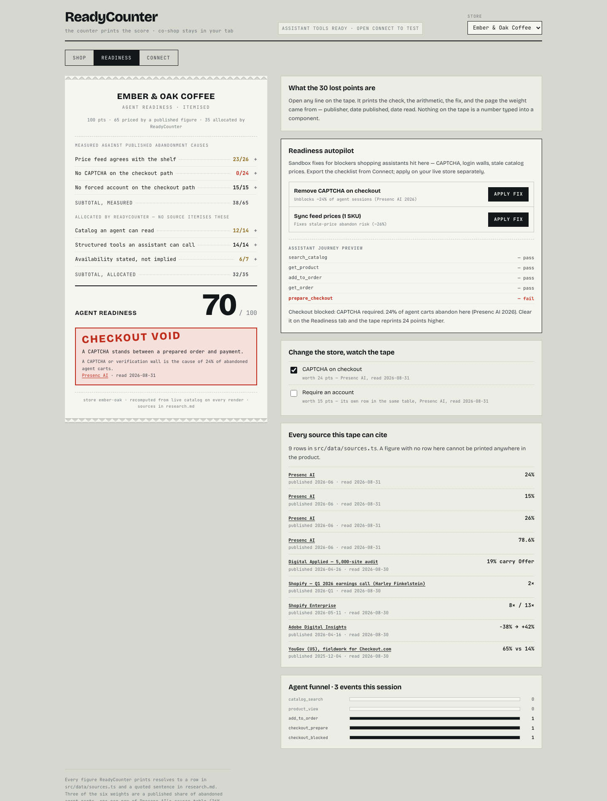

# ReadyCounter

**Agent-ready commerce — score your store, co-shop with your assistant.**

AI shoppers are arriving. Most stores lose them at checkout — CAPTCHA walls, login gates, stale catalog feeds. ReadyCounter gives merchants a **readiness score** with one-click fixes, and gives shoppers a **shared cart** where humans and assistants build the same order in one tab.

**Live:** https://tooltruth-webmcp.vercel.app · second store: `?store=neon-matcha`
· straight to a tab: `?view=merchant`



## Who it's for

| You are | You get |
|---------|---------|
| **Merchant / operator** | Readiness score /100, checkout blocker audit, catalog feed validation, autopilot fixes |
| **Shopper** | Browse, co-shop with your assistant, share a cart link — no account required |
| **Developer** | REST API, Shopify catalog import/export, 16 structured agent tools, OpenAPI spec |

## How it works

1. **Open the URL** — pick a store or import your catalog under Connect
2. **Shop** — add items yourself or let your assistant use structured tools (search, add to cart, prepare checkout)
3. **Readiness** — the store's score prints as an **itemised bill**: every point
   traced to a named check, its arithmetic, its one-line fix, and the page the
   weight came from. Open a line to read the source with its dates. Apply fixes
   and the bill reprints.
4. **Share** — copy a cart link or start a live session so someone else joins the same order

`prepare_checkout` validates the order and returns totals. **It never charges a card** — a human confirms payment in the browser.

## The score is an itemised bill, not a gauge

100 points across six checks. **Three of the weights are measured** — 26, 24 and
15 are three rows of one published table: the shares of abandoned agent carts
Presenc AI attributes to a stale price feed, to a CAPTCHA, and to a required
account. **The other 35 points we allocated ourselves**, and the tape says which
is which on the line, not in a footnote.

| Check | Points | Basis |
|---|---|---|
| Price feed agrees with the shelf | 26 | **measured** — Presenc AI, 26% row |
| No CAPTCHA on the checkout path | 24 | **measured** — Presenc AI, 24% row |
| No forced account on the checkout path | 15 | **measured** — Presenc AI, 15% row |
| Catalog an agent can read | 14 | allocated by us |
| Structured tools an assistant can call | 14 | allocated by us |
| Availability stated, not implied | 7 | allocated by us |

**No checkout wall is priced by us.** A CAPTCHA costs 24 and a forced account
costs 15 because Presenc AI publishes those two figures on two separate rows of
the same table; a store carrying both pays 39. All six rows of that table are
reproduced in [`research.md`](./research.md) — reproducing only two of them is
how this product shipped a wrong weight for a day.

Nothing is a constant typed into a component: a figure with no row in
[`src/data/sources.ts`](./src/data/sources.ts) cannot be printed anywhere in the
product, and `npm run verify` fails the build if a measured weight stops
equalling the figure its source publishes, if a source loses its URL or its read
date, or if a source URL is not quoted in [`research.md`](./research.md).

**Observable consequence:** clearing the CAPTCHA on Ember & Oak moves the score
**70 → 94** — a delta of exactly **24**, the published figure. Asserted in
`scripts/verify-readiness.mjs`, not eyeballed. Full derivation:
[`research.md` § How the readiness score is weighted](./research.md).

## Sample stores

| Store | URL | Notes |
|-------|-----|-------|
| Ember & Oak Coffee | _(default)_ | Specialty coffee — **70/100**, blocked by a CAPTCHA |
| Neon Matcha Lab | `?store=neon-matcha` | Ceremonial matcha — **71/100**, blocked by an account wall (15 pts), 4/14 catalog |

Import your own catalog: **Connect → Import your catalog** (Shopify JSON).

## API & integrations

| Endpoint | Purpose |
|----------|---------|
| `GET /api/v1/catalog?storeId=` | Products + Shopify-shaped export |
| `GET /api/v1/readiness?storeId=` | Score, checks, feed validation |
| `GET /api/v1/tools` | Agent tool manifest |
| `POST /api/v1/rooms` | Live co-shop sessions |
| `POST /api/v1/stores/custom` | Register catalog server-side |

Full reference: [`INTEGRATIONS.md`](./INTEGRATIONS.md) · OpenAPI at `/openapi.yaml`

## Agent tools (16)

Structured tools registered via WebMCP — search, cart, checkout validation, readiness, catalog import, live rooms. See [`src/webmcp/toolManifest.ts`](./src/webmcp/toolManifest.ts).

Test without the browser flag: **Connect → Agent tool console**.

## Run locally

```bash
npm install
npm run dev          # UI + co-shop
vercel dev           # UI + REST API + live sessions
npm run verify       # score sources, readiness, stores, integrations, ambition
npm run build        # tsc + vite, must exit 0
```

Every verify script asserts and exits non-zero. To see one go red, change a
weight in `src/lib/readiness.ts` and re-run `npm run verify`.

Screenshots of every surface at 1440px and 390px: [`docs/shots/`](./docs/shots/).

## Why readiness matters

Primary sources: [`research.md`](./research.md)

| Stat | Source |
|------|--------|
| Shopify: AI traffic **8×** YoY, AI orders **~13×** (Q1 2026) | [Shopify Enterprise](https://www.shopify.com/enterprise/blog/ai-search-insights) |
| Catalog-powered AI searches convert **2×** vs scraped data | [Shopify Q1 2026](https://stockanalysis.com/stocks/shop/transcripts/555081-q1-2026/) |
| Agent cart abandonment **~78.6%** — stale price **26%**, CAPTCHA **24%**, required account **15%** | [Presenc AI 2026](https://presenc.ai/research/agent-cart-abandonment-statistics-2026) |
| **65%** trust AI to compare · **14%** to buy autonomously | [YouGov / Checkout.com](https://yougov.com/en-us/articles/53808-american-trust-in-ai-for-retail-consumer-sentiment-in-2025) |

## Fork your own store

Add an entry to [`src/data/stores.ts`](./src/data/stores.ts) or import a feed. See [`FORK.md`](./FORK.md).

## Filming and submitting

One-take script with every number pre-verified: [`DEMO-SCRIPT.md`](./DEMO-SCRIPT.md).
Devpost paste: [`DEVPOST.md`](./DEVPOST.md). Design rulings and open decisions:
[`DECISIONS.md`](./DECISIONS.md).

## License

MIT
